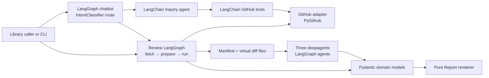
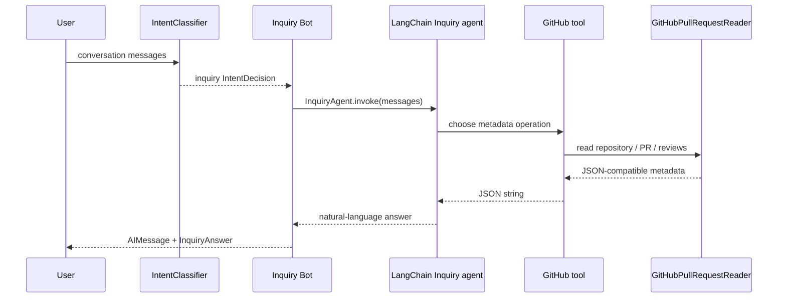

# Review Sheep Architecture

Review Sheep is a read-only Python library for understanding and reviewing
GitHub pull requests. Its runtime architecture is based on two agent
frameworks:

- **LangChain agents** provide model invocation, tool calling, messages, and
  structured output.
- **LangGraph** provides stateful conversation and Review workflow
  orchestration. The `deepagents` Review workers are also LangGraph agents
  built on LangChain primitives.

Pydantic domain models, the GitHub adapter, and Report rendering remain outside
the agent runtime. They form stable seams around nondeterministic model
behaviour.

## Architectural shape

The project exposes two capabilities with different cost and data access:

1. **Inquiry** answers conversational questions from pull-request metadata.
2. **Review** inspects a stable changed-code snapshot through three independent
   Review Lenses and returns structured Findings.



The two paths share the outer routing graph, GitHub adapter, and model
abstractions, but they do not share an agent prompt or worker graph. Metadata
questions should not pay the cost of fetching diffs, and code Review must not
rely on metadata-only tools.

## Framework responsibilities

### LangChain: agent and tool runtime

LangChain owns the model-facing interfaces:

- `langchain.agents.create_agent` creates the Inquiry agent.
- `langchain.tools.tool` exposes three read-only GitHub metadata operations.
- `BaseMessage`, `HumanMessage`, `AIMessage`, and `ToolMessage` represent
  conversation history.
- `BaseChatModel` is the injected model seam.
- `ToolStrategy` binds each Review Lens to a Pydantic structured-output model.

Provider-specific clients are caller-owned. The library accepts either a model
name or a `BaseChatModel`; only the CLI constructs `ChatOpenAI`.

### LangGraph: orchestration and state

The conversational interface is a compiled `StateGraph` with an explicit
intent route:

```text
START -> IntentClassifier
            |-- inquiry --> Bot ------> END
            |-- review  --> ReviewBot -> END
            +-- unrelated --> UnrelatedBot -> END
```

`ChatState` extends `MessagesState` and adds the latest Pydantic
`IntentDecision`, structured `InquiryAnswer`, or structured `Review`. The
legacy `InquiryChatState` name remains as a compatible state type. Each graph
invocation is one turn. Conversation history is passed back into the next
invocation by the caller or CLI; the graph currently has no checkpointer or
persistent store.

`IntentClassifier` is a LangChain agent with a Pydantic structured-output
contract. Metadata, greeting, and Review Sheep identity requests route to `Bot`,
while changed-code requests route to `ReviewBot`. Messages outside both
supported capabilities route to
`UnrelatedBot`, which invokes neither agent. The Review route retains an
explicitly extracted `owner/repo` and pull-request number across turns, asking
for whichever value is still missing.

The graph interface remains deep: callers supply the agents and messages, while
the graph handles classification, conditional routing, context collection,
error presentation, message accumulation, and structured result retention.

The Review Lenses are created with `deepagents.create_deep_agent`. Each worker
is a LangGraph agent with a `StateBackend`, filesystem tools, a Lens-specific
system prompt, and a LangChain `ToolStrategy` output contract.

Review itself is a separate compiled `StateGraph` hidden behind
`ReviewAgent.review`:

```text
START -> fetch_snapshot -> prepare_workspace -> run_review -> END
             |                    |
             +------ error -------+--------------------------> END
```

Each node owns one failure operation and writes either the next validated state
value or a final `ReviewError`. Conditional edges stop the workflow immediately
after a failed stage.

## Module map

| Module | Public interface | Responsibility |
| --- | --- | --- |
| `chat_graph.py` | `create_chatbot_graph`, `ChatState` | Classify each turn and route it to the Inquiry, Review, or unrelated Bot while retaining structured state. |
| `intent.py` | `create_intent_classifier`, `IntentClassifier` | Build the LangChain structured-output agent that chooses the graph route. |
| `inquiry.py` | `create_inquiry_agent`, `InquiryAgent.ask`, `InquiryAgent.invoke` | Build and run the metadata-only LangChain agent. |
| `review.py` | `create_deep_review_agent`, `ReviewAgent.review` | Compile and run the Review LangGraph, including snapshot preparation and every Lens. |
| `github.py` | `GitHubPullRequestReader` | Adapt PyGithub to both metadata reads and stable changed-code snapshots. |
| `domain.py` | Frozen Pydantic models | Define the data contracts for snapshots, manifests, Findings, Reviews, and failures. |
| `report.py` | `render_report` | Render a human-facing Report from a structured Review without changing it. |
| `chat.py` | `main` | Construct production adapters from `.env` and run the continuous CLI loop. |

## Inquiry path

Inquiry is optimized for low-cost, metadata-only questions such as “which pull
requests are waiting for review?” or “who approved PR 42?”.



The agent can call:

- `list_pull_requests`
- `get_pull_request`
- `get_pull_request_reviews`

Tool failures are converted to JSON error data so the agent can explain them
without crashing the graph. `InquiryAgent` converts invocation failures or an
empty model response into `InquiryAnswer(error=...)`. If a list tool reports
`truncated=true`, the structured answer records `incomplete=True`.

The system prompt identifies the agent as Review Sheep and lets it introduce its
read-only Inquiry and Review capabilities without calling tools. For metadata it
must use returned data only, include PR numbers and URLs, disclose truncation,
avoid inventing changed-code Findings, and answer in the user's language.

## Review path

Review is a deterministic LangGraph around nondeterministic Lens agents:

```text
ReviewAgent.review(repo, number)
  -> Review StateGraph
       -> fetch_snapshot node
       -> prepare_workspace node
       -> run_review node
            -> correctness deep agent
            -> security deep agent
            -> conventions-and-tests deep agent
       -> Review | ReviewError
```

### Stable snapshot

`GitHubPullRequestReader.fetch_snapshot` reads the pull request head SHA before
and after fetching changed files. If the head changes, the operation fails and
the caller can retry. Every Lens therefore reviews the same commit and uses the
same line coordinates.

### Shared workspace

The snapshot becomes an in-memory `ReviewWorkspace`:

- `/manifest.json` lists every changed file and its diff path.
- `/diffs/<path>.diff` contains the corresponding patch.

The workspace is loaded into each deep agent's `StateBackend`. Lenses read the
Manifest first and inspect relevant diffs with filesystem tools rather than
calling GitHub independently.

### Lens agents

Three independent deep agents examine the whole pull request:

- **correctness** traces behaviour and contracts across callers and callees;
- **security** traces data, identity, authorization, and trust seams;
- **conventions-and-tests** compares implementation, conventions, and tests.

They run in stable `Lens` enum order. Each one has a Lens-specific Pydantic
response model, and each Finding is fixed to the originating Lens. Findings are
concatenated without semantic merging or deduplication.

The current prompts require serial tool use inside a Lens agent. This avoids
provider-specific failures from parallel tool calls and makes execution easier
to reproduce.

## Domain and output contracts

All public data is represented by frozen Pydantic models:

- `PullRequestSnapshot` pins changed files to one head SHA.
- `Manifest` and `ManifestFile` describe the virtual Review filesystem.
- `Finding` combines `Location`, `Severity`, `Confidence`, and `Lens`.
- `Review` is the structured source of truth.
- `ReviewError` is stable failure data from a named pipeline stage.
- `Report` is a derived human-facing representation.
- `InquiryAnswer` contains exactly one of `text` or `error`.

Pydantic validation is the seam between model-produced data and trusted library
output. Invalid structured responses fail the Review run instead of leaking
partially trusted dictionaries to callers.

## Adapters and seams

The production and deterministic test adapters cross the same interfaces:

| Seam | Production adapter | Test adapter |
| --- | --- | --- |
| `PullRequestReader` | `GitHubPullRequestReader` over PyGithub | In-memory metadata readers |
| `SnapshotSource` | `GitHubPullRequestReader` over PyGithub | Deterministic or failing snapshot sources |
| `ReviewRunner` | `DeepAgentReviewRunner` | Deterministic Review runners |
| `IntentClassifier` | LangChain structured-output agent | Scripted classifiers |
| LangChain model | Provider `BaseChatModel`, such as `ChatOpenAI` | Deterministic chat models |

Dependencies are accepted by factories instead of created inside domain
modules. This keeps GitHub, model providers, and agent execution replaceable at
the seams without exposing their implementation details to callers.

## Error model

Errors are data at the public interfaces:

- Intent classification returns `IntentDecision(intent="unknown", error=...)`.
- An unrelated request returns `IntentDecision(intent="unrelated")` and invokes
  neither Inquiry nor Review.
- Inquiry returns `InquiryAnswer(error=...)`.
- Review returns `ReviewError` with `fetch_snapshot`, `prepare_workspace`, or
  `run_review` as the failed operation.
- The CLI reserves exit code `2` for configuration/model setup errors and `1`
  for GitHub/runtime setup errors; per-turn Inquiry failures remain in the
  conversation.

The library does not post comments, submit reviews, mutate labels, merge pull
requests, or perform any other GitHub write. A caller that wants publishing must
implement that separately from structured Findings.

## Runtime composition

The CLI in `scripts/review_chat.py` delegates to `review_sheep.chat.main` and
constructs this object graph:

```text
.env
  -> PyGithub client
  -> GitHubPullRequestReader
  -> ChatOpenAI
  -> create_inquiry_agent
  -> create_intent_classifier
  -> create_deep_review_agent
  -> create_chatbot_graph
  -> continuous terminal loop
```

Required environment variables are `GITHUB_TOKEN`, `OPENAI_MODEL`, and
`OPENAI_API_KEY`; `BASE_URL` is optional for OpenAI-compatible endpoints.

## Verification strategy

Tests exercise the same module interfaces used by production callers:

- graph tests assert the classifier's conditional Inquiry and Review routes,
  accumulated messages, and structured state;
- Inquiry tests use deterministic models and fake GitHub readers to verify tool
  selection, truncation, conversation, and failures;
- Review tests inject snapshots, runners, and deterministic deep-agent models
  through the same interface while the internal LangGraph remains unchanged;
- GitHub adapter tests verify metadata mapping and head-change detection;
- distribution smoke tests install the built wheel and exercise public imports.

No live GitHub repository or model provider is required by the test suite.

## Constraints and extension points

Current constraints:

- Python 3.11 or newer;
- read-only GitHub access;
- in-memory conversation state;
- one classifier plus Inquiry, Review, and unrelated Bot nodes, and three Review
  workflow nodes;
- Review Lenses run sequentially;
- no Finding merge or verification pass.

Natural extension points are adding a LangGraph checkpointer, adding another
intent route, introducing another Lens, or building a separate publishing
adapter. These additions should preserve the Pydantic contracts and the
read-only core.

Historical decisions and their tradeoffs are recorded in [`docs/adr`](docs/adr).
Domain terminology is defined in [`CONTEXT.md`](CONTEXT.md).
