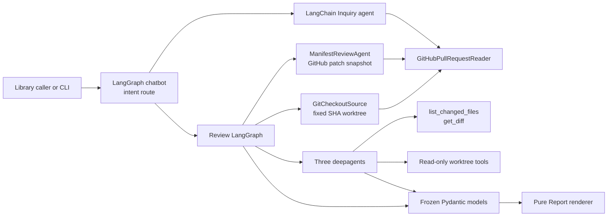
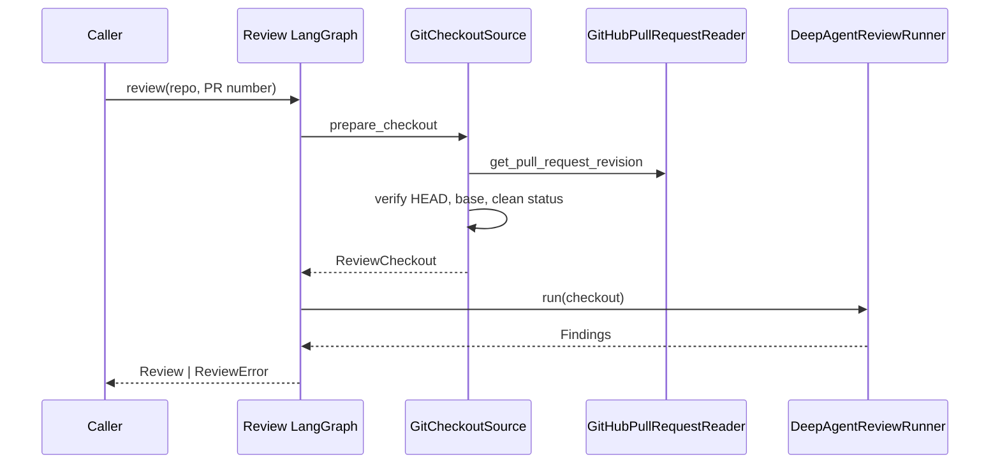
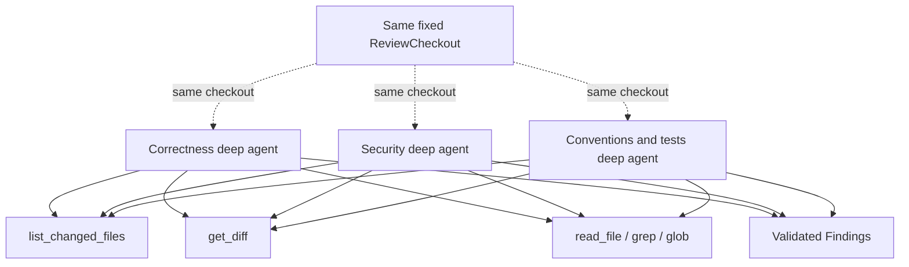

# Review Sheep Architecture

Review Sheep is a read-only Python library for understanding and reviewing
GitHub pull requests. LangChain provides agents, tool calling, messages, and
structured output; LangGraph provides the chatbot and Review workflows. Frozen
Pydantic models form the trusted boundary around model output.

## Architectural shape

The project exposes two capabilities:

1. **Inquiry** answers conversational questions from pull-request metadata.
2. **Review** inspects either an API-fetched Manifest or a complete local Git
   checkout pinned to the pull request's head SHA through three independent
   Review Lenses.



Inquiry and Review share routing, the GitHub adapter, and model abstractions,
but not prompts or tools. Metadata questions do not need changed code.
Interactive Review uses the GitHub files API so it can review arbitrary PRs
without cloning; CI Review uses a full checkout for complete repository context.

## Framework responsibilities

### LangChain

- `langchain.agents.create_agent` creates the Inquiry agent and intent
  classifier.
- LangChain tools expose three read-only GitHub metadata operations, Manifest
  virtual-file operations, and two read-only Git operations.
- `BaseChatModel` is the injected model seam.
- `ToolStrategy` validates each Lens against a Pydantic result type.

### LangGraph

The conversational graph routes each turn:

```text
START -> IntentClassifier
            |-- inquiry --> Bot ----------> END
            |-- review  --> ReviewBot ----> END
            +-- unrelated --> UnrelatedBot -> END
```

`ChatState` extends `MessagesState` with an `IntentDecision`, `InquiryAnswer`,
or `Review`. The caller passes returned conversation history into the next
invocation; there is currently no persistent checkpointer.

CI Review uses a separate graph hidden behind `ReviewAgent.review`:


`prepare_checkout` resolves the pull request's base and head SHA and verifies
the local Git worktree. `run_review` invokes every Lens and returns either a
structured `Review` or a `ReviewError`.

Chat Review uses a parallel implementation behind the same `review(repo,
number)` interface:

```text
START -> fetch_snapshot -> prepare_workspace -> run_review -> END
```

The snapshot node verifies that the PR head did not change while GitHub file
patches were fetched. The workspace node generates `/manifest.json` and one
virtual `/diffs/<path>.diff` file per changed path.

## Module map

| Module | Responsibility |
| --- | --- |
| `chat_graph.py` | Route each turn to Inquiry, Review, or the unrelated response. |
| `intent.py` | Build the structured-output intent agent. |
| `inquiry.py` | Build and run the metadata-only LangChain agent. |
| `checkout.py` | Validate a fixed Git checkout and provide read-only diff operations. |
| `manifest.py` | Build API snapshots into a Manifest and run the Chat Review LangGraph. |
| `lenses.py` | Define shared Lens prompts and structured Finding contracts. |
| `review.py` | Compile fixed-checkout Review and run its deep Lens agents. |
| `github.py` | Adapt PyGithub to metadata, revisions, and stable patch snapshots. |
| `domain.py` | Define frozen public data contracts. |
| `report.py` | Render a human-facing Report without changing the Review. |
| `providers.py` | Construct shared GitHub and model-provider clients. |
| `tracing.py` | Configure optional per-turn Langfuse LangGraph callbacks. |
| `chat.py` | Assemble production adapters and run the CLI. |
| `ci.py` | Run one non-interactive Review with CI-safe output and exit codes. |

## Inquiry path

Inquiry can call:

- `list_pull_requests`
- `get_pull_request`
- `get_pull_request_reviews`

Tool failures become JSON error data so the agent can explain them. The system
prompt identifies Review Sheep, allows a tool-free self-introduction, prohibits
invented changed-code Findings, and asks the agent to answer in the user's
language.

## Chat Manifest

`GitHubPullRequestReader.fetch_snapshot` reads the PR base/head SHA and changed
file patches, then reads the head SHA again. A changed head aborts that Review
instead of mixing revisions. `ManifestReviewAgent` converts the stable snapshot
into an in-memory `ReviewWorkspace` containing:

- `/manifest.json`, an index with repository, PR, base/head SHA, paths, status,
  line counts, rename source, and virtual diff paths; and
- `/diffs/<path>.diff`, the GitHub patch for each changed file.

Every Lens receives the same immutable virtual files through `StateBackend`.
This path requires no local checkout and is the production adapter used by
`scripts/review_chat.py`. GitHub patches can omit binary changes or unchanged
context, so Manifest prompts require Findings to remain grounded in the
available changed-code evidence.

## CI Review checkout

`GitHubPullRequestReader.get_pull_request_revision` returns only the PR's
`base_sha` and `head_sha`. `GitCheckoutSource` then verifies that:

- the configured path belongs to a Git worktree;
- `HEAD` exactly equals the PR head SHA;
- the PR base commit exists locally; and
- tracked and untracked worktree state is clean.

The resulting `ReviewCheckout` is the single code source for every Lens. There
is no generated `manifest.json`, no virtual `/diffs` tree, and no GitHub patch
fetch. A changed-file index is generated when requested with:

```text
git diff --name-status --find-renames <base>...<head>
```

Diff contents are generated from the same commit range, optionally restricted
to one repository-relative path. Because the checkout contains the complete
head tree, agents can also read unchanged callers, callees, configuration, and
tests.

The checkout is prepared by CI or another trusted library caller.
`REVIEW_CHECKOUT` applies to `scripts/review_pr.py`, not the interactive Chat.
The checkout must not contain credentials: deepagents path confinement prevents
leaving the root, but readable files inside the root are intentionally visible
to the reviewer.

## CI ReviewAgent flow



## ReviewAgent Lens flow



Both Review adapters start all three Lenses concurrently. Each worker receives
a copy of the current tracing context, so Langfuse records sibling Lens
observations under the same turn. Findings are flattened afterward in stable
`correctness`, `security`, `conventions-and-tests` order. Within a Lens,
independent tool calls are requested in the same assistant message;
dependent calls remain sequential. The configured gateway must support
concurrent model requests and parallel tool results.

Each Lens receives a `FilesystemBackend` rooted at the checkout with virtual
path confinement. Deepagents filesystem write permission is denied for all
paths, and the system prompt also prohibits mutation. The custom Git tools use
argument-vector subprocess calls without a shell and reject parent traversal.

Each Lens has its own Pydantic response model, fixing every Finding to the
originating Lens. Findings are concatenated without semantic merging or
deduplication.

## Domain contracts

- `PullRequestRevision` identifies the base and head commits GitHub expects.
- `PullRequestSnapshot` identifies one stable set of GitHub changed-file patches.
- `Manifest` indexes the virtual diff files built from that snapshot.
- `ReviewWorkspace` contains one Manifest and its immutable virtual files.
- `ReviewCheckout` identifies the verified local root and immutable commit
  range.
- `Finding` combines `Location`, `Severity`, `Confidence`, and `Lens`.
- `Review` records base/head SHA and the validated Findings.
- `ReviewError` names the failed Manifest, checkout, or model stage.
- `Report` is derived human-facing text.
- `InquiryAnswer` contains exactly one of `text` or `error`.

## Adapters and seams

| Seam | Production adapter | Typical test adapter |
| --- | --- | --- |
| `PullRequestReader` | `GitHubPullRequestReader` | In-memory metadata reader |
| `PullRequestRevisionSource` | `GitHubPullRequestReader` | Fixed revision source |
| `SnapshotSource` | `GitHubPullRequestReader` | Fixed or failing snapshot source |
| `ReviewCheckoutSource` | `GitCheckoutSource` | Fixed or failing checkout source |
| `ReviewRunner` | `DeepAgentReviewRunner` | Deterministic runner |
| Chat `Reviewer` | `ManifestReviewAgent` | Scripted reviewer |
| `IntentClassifier` | LangChain structured-output agent | Scripted classifier |
| LangChain model | Provider `BaseChatModel` | Deterministic model |

## Error and write model

Errors are public data: classifier failures produce `unknown`, Inquiry returns
`InquiryAnswer(error=...)`, and Review returns a stage-specific `ReviewError`.
An unrelated turn invokes neither agent.

The Review Sheep library does not post comments, submit reviews, mutate labels,
merge pull requests, or modify the Review checkout. Publishing remains a
separate caller responsibility. The bundled GitHub Actions workflow acts as a
Report sink and upserts one pull-request conversation comment after a successful
CI Review.

## Runtime composition

```text
process environment / trusted secret adapter
  -> ChatConfig
  -> PyGithub client -> GitHubPullRequestReader
  -> PullRequestSnapshot -> Manifest -> virtual diff files
  -> ChatOpenAI
  -> InquiryAgent + IntentClassifier + ManifestReviewAgent
  -> chatbot LangGraph
  -> terminal loop
```

The interactive Chat CLI requires `GITHUB_TOKEN`, `OPENAI_MODEL`, and
`OPENAI_API_KEY`; `BASE_URL` is optional. The non-interactive CI entrypoint uses
`GITHUB_TOKEN`, `ANTHROPIC_AUTH_TOKEN`, `ANTHROPIC_BASE_URL`, and the selected
`ANTHROPIC_DEFAULT_{HAIKU|SONNET|OPUS}_MODEL`. Custom headers and model tier are
optional.

The interactive entrypoint configures `review_sheep.*` console logs at
`REVIEW_LOG_LEVEL` (default `INFO`). Logs describe intermediate state and counts
without printing credentials or full source/diff contents.

When Langfuse credentials are configured, `chat.py` attaches one
`CallbackHandler` to each outer chatbot invocation. LangGraph propagates that
callback into nested LangChain agents and the Manifest Review graph. One random
session ID groups all turns in the terminal process, and shutdown flushes the
Langfuse client. CI Review does not enable Langfuse tracing.

The reusable `.github/workflows/review-pr.yml` workflow checks out the caller's
PR head and full history into `review-target`, downloads Review Sheep into the
separate `review-sheep` directory, and invokes `scripts/review_pr.py`. Keeping
the directories separate prevents dependency installation from making the
verified Review Checkout dirty. After a successful Review, the workflow appends
the Report to the job summary and uses its scoped `GITHUB_TOKEN` to create or
update one marker-owned pull-request conversation comment.

Tests use temporary real Git repositories for checkout invariants and diff
behavior, deterministic adapters for both LangGraphs, and a built-wheel smoke
test. No live GitHub repository or model provider is required.

Historical decisions are in [`docs/adr`](docs/adr), and canonical terminology
is in [`CONTEXT.md`](CONTEXT.md).
