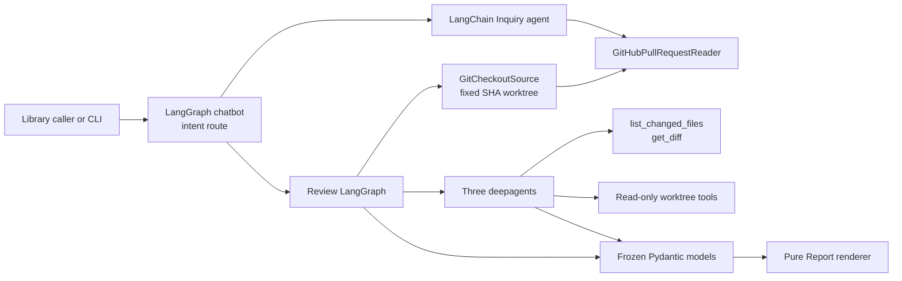
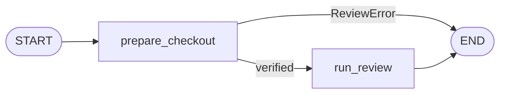
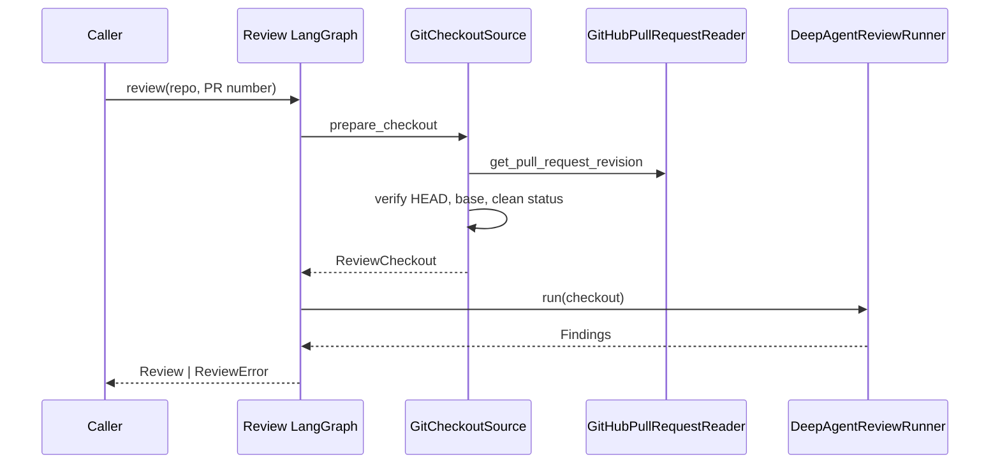
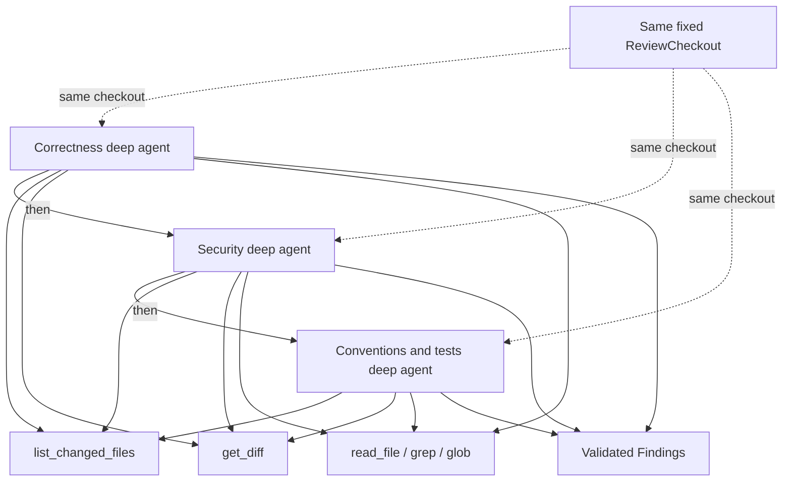

# Review Sheep Architecture

Review Sheep is a read-only Python library for understanding and reviewing
GitHub pull requests. LangChain provides agents, tool calling, messages, and
structured output; LangGraph provides the chatbot and Review workflows. Frozen
Pydantic models form the trusted boundary around model output.

## Architectural shape

The project exposes two capabilities:

1. **Inquiry** answers conversational questions from pull-request metadata.
2. **Review** inspects a complete local Git checkout pinned to the pull
   request's head SHA through three independent Review Lenses.



Inquiry and Review share routing, the GitHub adapter, and model abstractions,
but not prompts or tools. Metadata questions do not need a checkout; Review
does not depend on incomplete patches returned by the GitHub files API.

## Framework responsibilities

### LangChain

- `langchain.agents.create_agent` creates the Inquiry agent and intent
  classifier.
- LangChain tools expose three read-only GitHub metadata operations and two
  read-only Git operations.
- `BaseChatModel` is the injected model seam.
- `ToolStrategy` validates each Lens against a Pydantic result type.

### LangGraph

The conversational graph routes each turn:

```text
START -> IntentClassifier
            |-- inquiry --> Bot ----------> END
            |-- review  --> ReviewBot ----> END
            +-- unrelated --> UnrelatedBot -> END
```

`ChatState` extends `MessagesState` with an `IntentDecision`, `InquiryAnswer`,
or `Review`. The caller passes returned conversation history into the next
invocation; there is currently no persistent checkpointer.

Review uses a separate graph hidden behind `ReviewAgent.review`:



`prepare_checkout` resolves the pull request's base and head SHA and verifies
the local Git worktree. `run_review` invokes every Lens and returns either a
structured `Review` or a `ReviewError`.

## Module map

| Module | Responsibility |
| --- | --- |
| `chat_graph.py` | Route each turn to Inquiry, Review, or the unrelated response. |
| `intent.py` | Build the structured-output intent agent. |
| `inquiry.py` | Build and run the metadata-only LangChain agent. |
| `checkout.py` | Validate a fixed Git checkout and provide read-only diff operations. |
| `review.py` | Compile the Review LangGraph and run the deep Lens agents. |
| `github.py` | Adapt PyGithub to metadata reads and pull-request revision lookup. |
| `domain.py` | Define frozen public data contracts. |
| `report.py` | Render a human-facing Report without changing the Review. |
| `providers.py` | Construct shared GitHub and model-provider clients. |
| `chat.py` | Assemble production adapters and run the CLI. |
| `ci.py` | Run one non-interactive Review with CI-safe output and exit codes. |

## Inquiry path

Inquiry can call:

- `list_pull_requests`
- `get_pull_request`
- `get_pull_request_reviews`

Tool failures become JSON error data so the agent can explain them. The system
prompt identifies Review Sheep, allows a tool-free self-introduction, prohibits
invented changed-code Findings, and asks the agent to answer in the user's
language.

## Review checkout

`GitHubPullRequestReader.get_pull_request_revision` returns only the PR's
`base_sha` and `head_sha`. `GitCheckoutSource` then verifies that:

- the configured path belongs to a Git worktree;
- `HEAD` exactly equals the PR head SHA;
- the PR base commit exists locally; and
- tracked and untracked worktree state is clean.

The resulting `ReviewCheckout` is the single code source for every Lens. There
is no generated `manifest.json`, no virtual `/diffs` tree, and no GitHub patch
fetch. A changed-file index is generated when requested with:

```text
git diff --name-status --find-renames <base>...<head>
```

Diff contents are generated from the same commit range, optionally restricted
to one repository-relative path. Because the checkout contains the complete
head tree, agents can also read unchanged callers, callees, configuration, and
tests.

The checkout should be prepared by CI or another trusted caller. In the CLI,
`REVIEW_CHECKOUT` selects its root and defaults to the current directory. The
checkout must not contain credentials: deepagents path confinement prevents
leaving the root, but readable files inside the root are intentionally visible
to the reviewer.

## ReviewAgent flow



## ReviewAgent Lens flow



Lenses run in stable enum order. Within a Lens, independent tool calls are
requested in the same assistant message so LangChain/deepagents may execute
them concurrently; dependent calls remain sequential. The configured gateway
must support parallel tool results.

Each Lens receives a `FilesystemBackend` rooted at the checkout with virtual
path confinement. Deepagents filesystem write permission is denied for all
paths, and the system prompt also prohibits mutation. The custom Git tools use
argument-vector subprocess calls without a shell and reject parent traversal.

Each Lens has its own Pydantic response model, fixing every Finding to the
originating Lens. Findings are concatenated without semantic merging or
deduplication.

## Domain contracts

- `PullRequestRevision` identifies the base and head commits GitHub expects.
- `ReviewCheckout` identifies the verified local root and immutable commit
  range.
- `Finding` combines `Location`, `Severity`, `Confidence`, and `Lens`.
- `Review` records base/head SHA and the validated Findings.
- `ReviewError` names either `prepare_checkout` or `run_review`.
- `Report` is derived human-facing text.
- `InquiryAnswer` contains exactly one of `text` or `error`.

## Adapters and seams

| Seam | Production adapter | Typical test adapter |
| --- | --- | --- |
| `PullRequestReader` | `GitHubPullRequestReader` | In-memory metadata reader |
| `PullRequestRevisionSource` | `GitHubPullRequestReader` | Fixed revision source |
| `ReviewCheckoutSource` | `GitCheckoutSource` | Fixed or failing checkout source |
| `ReviewRunner` | `DeepAgentReviewRunner` | Deterministic runner |
| `IntentClassifier` | LangChain structured-output agent | Scripted classifier |
| LangChain model | Provider `BaseChatModel` | Deterministic model |

## Error and write model

Errors are public data: classifier failures produce `unknown`, Inquiry returns
`InquiryAnswer(error=...)`, and Review returns a stage-specific `ReviewError`.
An unrelated turn invokes neither agent.

Review Sheep does not post comments, submit reviews, mutate labels, merge pull
requests, or modify the Review checkout. Publishing remains a separate caller
responsibility.

## Runtime composition

```text
.env
  -> PyGithub client -> GitHubPullRequestReader
  -> REVIEW_CHECKOUT -> GitCheckoutSource
  -> ChatOpenAI
  -> InquiryAgent + IntentClassifier + ReviewAgent
  -> chatbot LangGraph
  -> terminal loop
```

Required environment variables are `GITHUB_TOKEN`, `OPENAI_MODEL`, and
`OPENAI_API_KEY`. `BASE_URL` and `REVIEW_CHECKOUT` are optional.

The reusable `.github/workflows/review-pr.yml` workflow checks out the caller's
PR head and full history into `review-target`, downloads Review Sheep into the
separate `review-sheep` directory, and invokes `scripts/review_pr.py`. Keeping
the directories separate prevents dependency installation from making the
verified Review Checkout dirty.

Tests use temporary real Git repositories for checkout invariants and diff
behavior, deterministic adapters for both LangGraphs, and a built-wheel smoke
test. No live GitHub repository or model provider is required.

Historical decisions are in [`docs/adr`](docs/adr), and canonical terminology
is in [`CONTEXT.md`](CONTEXT.md).
